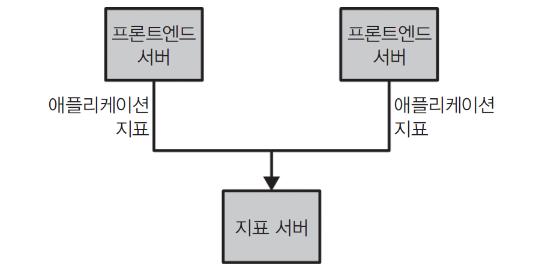

## kafka를 시작하기 앞서
kafka는 단순 데이터베이스 이상으로 스트림으로서의 데이터에 초점을 맞추고 있다.
분산 클러스터 형태를 가지고 모든 종류의 데이터 스트림을 가지고 있어서 확장 가능한 플랫폼 역할도 가능하다.
가령 매우 큰 규모의 데이터 스트림을 저장하고 지속적으로 처리하는 것이 가능하다.
low latency라는 특성을 갖기 때문에 다른 빅데이터를 다루는 프로그램과 달리 비지니스 애플리케이션의 코어로 사용이 가능하다.

이런 매력적인 특성을 가지고 있기 때문에 이전 프로젝트에서 도입을 하려고 했으나 개인적인 사정으로 빠지게 되어서
매우 아쉬움을 느끼고 있다. 이 kafka를 배우려고 할 때 도움을 주신 분들에게 감사함을 느끼며 첫 글을 개시하고자 한다.

# kafka 시작하기
조직에서 데이터를 이동시키는 작업에서 더 적은 노력이 들수록 핵심 비지니스에 집중이 가능하다. 
그래서 data-driven enterprise에서 파이프라인이 중요한 이유이다. 

## 발행/구독 메시지 전달 패턴
---
전송자가 데이터를 보낼 때 직접 수신자로 보내지 않는 구조이다. **발행자 Producer**는 메시지를 Broker에 발행한다.
**구독자 Consumer**는 필요한 메시지만 구독하여 가져간다. 발행/구독 시스템에는 대개 발행된 메시지를 중계하는 **Broker**가 있다.

이전의 발행자와 구독자가 직접 연결된 형태에는 애플리케이션의 종류와 개수가 많아질 수록 추적이 힘들다는 단점이 존재한다.
이를 개선한 형태로 지표를 받는 하나의 애플리케이션을 만들고 이에 관해 질의를 제공가능한 서버를 둔다.



이처럼 지표를 다루는 것 이외에 로그 메시지에 대해서도 비슷한 작업을 해주면된다. 그리고 프론트엔드 사이트에서 사용자 활동을 추적해서
정보를 개발자에게 제공하거나 보고서를 사용할 때도 쓸 수가 있다. 목적이 많아질수록 아래와 같이 중복이 많아지고 버그와 한계도 제각각인 
다수의 데이터 큐 시스템을 유지 관리해야 한다.


비지니스가 확장됨에 따라 함께 확장되는, 일반화된 유형의 데이터를 발행하고 구독가능한 중앙 집중화된 시스템이 필요해졌다.

## 메시지와 배치
- **메시지**
  - 데이터의 기본단위
  - 배치 단위로 저장된다.
    - 오버 헤드를 줄이고 latency와 thoughtput 사이에 trade-off를 발생시킨다.
    - 즉, 배치 크기가 커질수록 시간당 처리하는 메시지수가 늘어나고, 전달되는데 걸리는 시간이 늘어난다.
  - 키라 불리는 메타데이터를 포함한다.
    
- **스키마**
  - 메시지는 내용을 이해하기 쉽도록 JSON, XML 양식으로 보내는 것이 권장된다.
  - 실무에서는 대부분의 서비스는 메시지 형식으로 JSON을 사용하지만, 대규모 시스템에서는 Schema Registry와 함께 Avro 또는 Protobuf를 사용하는 경우가 많다.
- **토픽**
  - 데이터베이스의 테이블이나 파일 시스템의 폴더와 유사
  - 토픽은 메시지를 저장하는 논리적인 단위이다.
  - 실제 데이터는 토픽 내부의 여러 파티션에 분산 저장된다.
  - 여러 개의 파티션으로 나뉘어진다.
  - 토픽 안의 메세지 전체에 관해 순서는 보장되지 않는다.
    - 다만 단일 파티션 내에서 순서가 보장된다.
  
> 스트림:
  파티션의 개수와 상관없이 하나의 토픽에 저장된 데이터로 간주, 프로듀서로부터 컨슈머로의 데이터
  흐름을 나타낸다. 


## 프로듀서와 컨슈머
카프카 클라이언트는 시스템의 사용자이고 기본적으로 프로듀서, 컨슈머 두가지로 나뉜다.
여기서 고급 클라이언트로 데이터 통합에 사용되는 카프카 커넥트 api, 스트림 처리에 사용되는 카프카 스트림즈이다.

1. **프로듀서**
  새로운 메시지를 생성한다. 다른 발행/구독 시스템에서 발행자, 작성자라고 불린다.
  기본적으로 프로듀서는 메시지를 쓸 때 토픽에 속한 파티션들 사이에 고르게 나눠서 설치된다.
  메시지 키와 키 값의 해시를 특정 파티션으로 대응시켜 주는 파티셔너를 사용해서 구현된다. 

2. **컨슈머**
   메시지를 읽는다. 다른 발행/구독 시스템에서는 구독자, 독자라고 한다. 
   1개 이상의 토픽을 구독해서 여기에 저장된 메시지들을 각 파티션에 쓰여진 대로 읽어온다.
   또한 offset을 기록함으로써 어느 메세지까지 읽었는지를 유지한다.
   
  여기서 offset은 메시지를 저장할 때 메시지에 부여해주는 메타데이터이고 파티션 내에서 메시지의 순서를 나타내는 고유 번호이다.  

  또한 컨슈머는 컨슈머 그룹의 일원으로서 작동한다. **컨슈머 그룹**은 토픽에 저장된 데이터를 읽어오기 위한 하나이상의 컨슈머이다.
  이는 각 파티션이 하나의 컨슈머에 의해서만 읽히도록 하고 컨슈머에서 파티션으로의 대응관계를 **소유권**이라고 한다.
  
## 브로커와 클러스터
하나의 카프커 서버를 **브로커**라 부른다. 브로커는 프로듀서로부터 메시지를 받아 오프셋을 할당한 뒤 디스크 저장소에 쓴다.
브로커는 컨슈머의 파티션 읽기 요청 역시 처리하고 발행한 뒤의 메시지를 보내준다.
하나의 브로커는 초당 수천 개의 파티션과 수백만 개의 메시지를 처리하는 것이 가능하다.

카프카 브로커는 **클러스터**의 일부로 작동한다. 하나의 클러스터 안에 여러 개의 브로커가 포함될 수 있고 
하나의 브로커가 클러스터 컨트롤러 역할을 하게 된다. 

이때 컨트롤러의 역할
1. 파티션을 브로커에 할당
2. 장애가 발생한 브로커를 모니터링하는 관리기능 수행

파티션은 클러스터 안의 브로커가 담당하고 이를 **파티션 리더**라고 한다. 복제된 파티션에는 여러 브로커가 할당 가능한데
이를 파티션의 **팔로워**라고 한다.

kafka는 RabbitMQ와 달리 Consumer가 읽었다고 해서 메시지가 삭제되지 않는다. 또한 카프카의 핵심기능 중 하나로 메시지를 지속성 있게 보관하는 보존(retention)기능이 있다. 특정 기간, 특정 사이즈가 될 때까지 보관하고 
한도값에 도달하면 메세지는 만료되어 사라진다. 사용자 활동 추적 토픽, 애플리케이션 지표 등 목적에 맞게 보존 설정을 하면 된다.

## 다중 클러스터 
장점
- 데이터 유형별 분리
- 보안 요구사항을 충족 시키기 위한 격리
- 재해 복구를 대비한 다중 데이터 센터

카프카 프로젝트는 데이터를 다른 클러스터로 복제하는데 사용되는 미러데이터라는 툴을 포함한다.


## Kafka가 대규모 서비스에서 선택되는 이유
1. 자연스럽게 여러 프로듀서를 처리할 수 있다. 많은 프론트엔드 시스템으로부터 데이터를 수집하고 일관성을 유지하기 좋다.
2. 많은 컨슈머가 상호 간섭 없이 어떠한 메시지 스트림을 읽는 것이 가능하다.
3. 컨슈머들이 항상 실시간으로 데이터를 읽어올 필요가 없다.
   다른 메시지 스트림들이 각종 트래픽 폭주, 느린 처리 속도와 같은 사항에도 데이터 유실의 위험은 없다.
4. 전체의 가용성에 영향을 주지 않으면서 확장이 가능하다.

# kafka 로컬에 도입하기
지금 내가 보고있는 카프카 핵심가이드 기준으로는 kafka가 3.x.x 버전이라서 apache zoo-keeper를 도입하고 카프카를 설치하여 두개를 사용하는 구조이지만
kafka 4.0부터 kRaft라고 zoo-keeper 없이 kafka의 이미지로만 실행하는 것이 가능하다.
```yaml
services:
  kafka:
    image: apache/kafka:4.3.1
    container_name: kafka
    ports:
      - "9092:9092"
    volumes:
      - kafka-data:/var/lib/kafka/data
    restart: unless-stopped

volumes:
    kafka-data:

```
이런 식으로 docker compose 파일을 만들어주고 kafka를 실행한다.
> docker exec -it kafka bash

명령어를 사용하여 카프카에 접속을 한 뒤 cd /opt/kafka/bin를 통해 이동해주고 실습을 진행하게 된다.

### 토픽 생성

> ./kafka-topics.sh \
--bootstrap-server localhost:9092 \
--create \
--topic study-topic \
--partitions 1 \
--replication-factor 1

복재 개수 하나, 토픽 하나, 파티션 하나로 해서 기본적인 토픽을 만들어준다. 

### 프로듀서로 메시지 전송 

> ./kafka-console-producer.sh \
--bootstrap-server localhost:9092 \
--topic study-topic

여기서 메시지를 입력하고 ctrl+ c로 종료하여 메시지를 전달한다.

### 컨슈머로 메시지 읽기
> ./kafka-console-consumer.sh \
--bootstrap-server localhost:9092 \
--topic study-topic \
--from-beginning

--from beginning으로 처음부터 메시지를 읽게 된다. producer -> kafka 저장 -> consumer에서 kafka 조회
이러한 순서로 받아드리게 된다.

### 기존 zoo-keeper의 역할
- 기존 zoo-keeper이 한 일
- Kafka 브로커 등록과 상태 관리
- 컨트롤러 선출 지원
- 토픽 및 파티션 메타데이터 관리
- 파티션 리더 정보 관리
- 일부 설정 정보 보관

지금은 KRaft에서 Kafka가 자체 Raft 기반 메타 데이터 쿼럼을 사용한다.
Kafka Controller Quorum라는 클러스터 메타데이터를 자체적으로 관리하는 프로토콜을 사용하여 활성 컨트롤러를 선출한다.