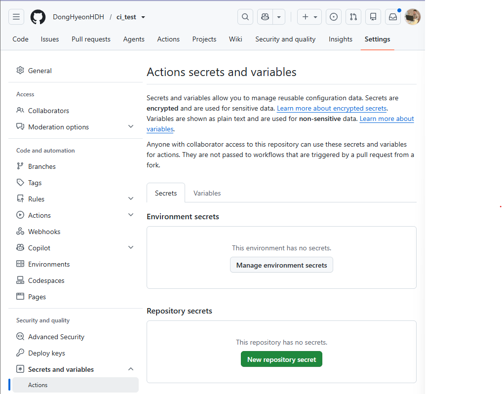
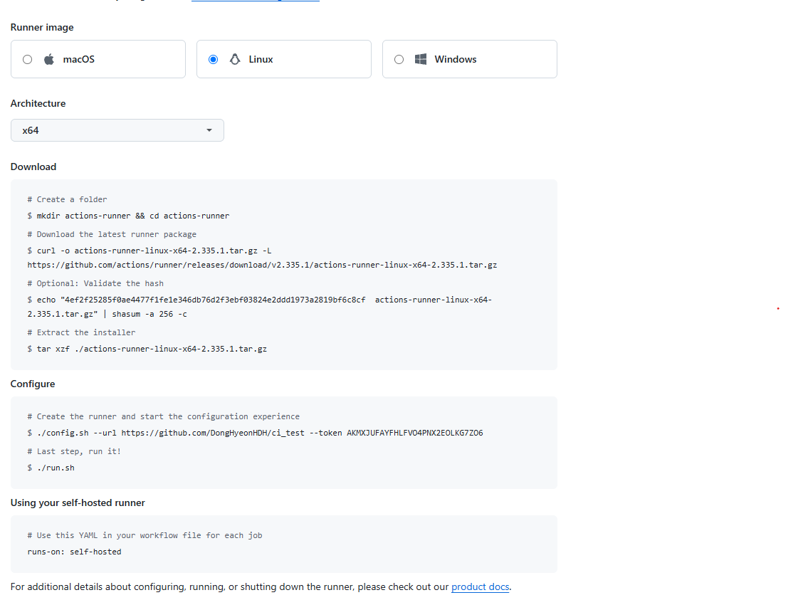

# 서론 
난이도로 따지면 동적배포보다는 정적배포가 쉽다고 볼 수가 있다. 하지만 우리가 구축하는 대다수의 프로그램들은 데이터베이스와 통신하는 어플리케이션이기 때문에 동적배포가 필요하다고
볼 수가 있다. 저번에 내가 정적배포를 시도하다가 만났던 

```yaml
  Unable to determine Dialect without JDBC metadata
```
와 같은 오류는 DB연결에서 발생하는 오류도 사실상 동적배포의 영역에서 만나는 오류라고 볼 수가 있다.

>   브라우저 -> (Http) -> Spring boot -> (JDBC) -> MySQL
    이러한 과정으로 접근을 하게 되는데 사용자의 요청에 따라 결과가 달라지게 되므로  

정적은 이미 만들어진 (정적인) html, css, js 파일을 클라이언트에게 제공하는 것이라고 볼 수가 있고 동적 웹은 직접 html,css, js를 만들어서 클라이언트에게 던져주는 것이다.

# github action으로 배포관리 해주기
github action은 github에서 제공해주는 ci/cd (지속적 통합/ 지속적 배포) 자동화 도구이다. 다른 말로 코드가 변경되면 미리 정의한 작업을 자동으로 실행해주는 시스템이다.
이전에는 개발자가 직접 (코드 작성 -> git push -> 서버 접속 -> 테스트 실행 -> 빌드 -> 배포)까지의 일을 반복했어야 했다.
문제는 테스트를 깜빡하고, 빌드 확인을 안하고, 실수 등이 발생가능 하다.

## github actions의 원리
```yaml
name: CI

on:
  push:
    branches:
      - main
env:
  REGISTRY: ghcr.io
```
와 같은 코드가 있다면 의미는 main 브랜치에 push가 발생한다면 github 이벤트가 발생 -> Action 실행이라는 흐름을 의미한다.

1. Developer
↓ git push
2. GitHub Repository
↓ 이벤트 감지
3. GitHub Runner
↓ 
4. Workflow 실행

- ghcr.io
  - GitHub Container Registry에 업로드를 하는 것을 의미한다.
- Github Runner
  - github actions에서 설정한 ci/cd 워크플로우를 실행하는 가상 머신 또는 서버 컴퓨터를 의미한다.
- runs-on: ubuntu:latest
  - github에서 제공하는 ubuntu VM이 생성되고 실행을 하게 된다.

## Ci를 위한 워크플로 설정
```yaml
name: ci-workflow.yml

on:
  pull_request:
    branches:
      - dev
      - main

jobs:

  code-test:
    name: 코드 테스트
    runs-on: ubuntu-latest
    steps:

      - name: 브랜치로 체크아웃
        uses: actions/checkout@v6

      - name: JDK 설치
        uses: actions/setup-java@v5
        with:
          distribution: 'temurin'
          java-version: 25

      - name: gradlew 권한 세팅
        run: chmod +x ./gradlew

      - name: 태스트 실행
        run: ./gradlew test --no-daemon
```

.github에 이렇게 ci를 위한 기능을 추가했다. 만약 실행순서를 보장하고 싶다면 
needs:에 실행하고 싶은 job을 기록하면 될 것 같다. 

## release를 위한 워크플로 파일 설정
```yaml
name: Build and release docker image

on:
  push:
    branches:
      #      - master
      - dev
env:
  REGISTRY: ghcr.io

jobs:
  build-image:
    name: 도커 이미지 빌드
    runs-on: ubuntu-latest
    #    needs: tagging

    permissions:
      contents: read
      packages: write
      attestations: write
      id-token: write

    steps:
      - name: 리포지터리로 체크아웃
        uses: actions/checkout@v6

      - name: JDK 세팅
        uses: actions/setup-java@v5
        with:
          distribution: 'temurin'
          java-version: '25'

      - name: gradlew 권한세팅
        run: chmod +x ./gradlew

      - name: Gradle 빌드
        run: ./gradlew build -x test

      - name: 레지스트리에 로그인
        uses: docker/login-action@v4
        with:
          registry: ${{ env.REGISTRY }}
          username: ${{ github.actor }}
          password: ${{ secrets.GITHUB_TOKEN }}

      - name: 메타데이터 추출
        id: meta
        uses: docker/metadata-action@v6
        with:
          images: ${{ env.REGISTRY }}/${{ github.repository }}
          tags: |
            type=sha
            type=raw,value=latest

      - name: 빌드 및 이미지 푸시
        uses: docker/build-push-action@v7
        with:
          context: .
          push: true
          tags: ${{ steps.meta.outputs.tags }}
```

## github secrets 설정
github actions는 docker hub 로그인, EC2 서버 접속 등 배포 과정에서 민감한 정보를 사용해야 한다.
Docker Hub 아이디, EC2 SSH Private Key, 데이터베이스 비밀번호 등 workflow 파일에 작성되면 노출될 위험이 있다. 
이러한 정보는 github secrets로 보관하는 편이 좋다.


## github runners 설정

github runners의 self-hosted 서버를 사용할 때 settings에 runners에 들어가서 새로운 new self-hosted runner을 구축해줘야 한다.
runner를 만들어주면 os에 따라 다른 코드가 나오는데 이를 연결하는 가상머신에 입력해주면 된다.   


