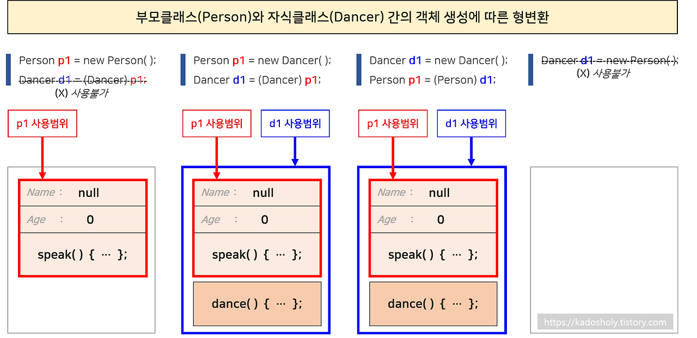

## 캡슐화를 위한 싱글톤 패턴

---

#### 필요 이유

객체의 생성을 제한하는 경우

- 객체를 계속 생성/삭제하는데 많은 비용이 들어서 재사용이 유리한 경우
- 여러 객체가 필요없는 경우
  - 객체 구분 필요없는 경우
  - 수정가능한 멤버 변수가 없고 기능만 있는 경우

#### 작성 방법

- 외부에서 생성자에 접근 금지
- 내부에서는 private에 접근 가능하므로 생성자 호출 시 객체 생성
- 외부에서 private member에 접근 가능한 getter 생성
  - 외부에서는 언제나 getter을 이용해서만 참조가능하게 할 것


## 다형성

---

상속 관계에 있을 때 조상 클래스의 타입으로 자식 클래스 객체를 참조하는 것이 가능하다.

다형성과 참조형 객체의 형변환

- 메모리에 있는 것과 사용할 수 있는 것의 차이
  - 메모리에 있더라도 참조하는 변수 타입에 따라 접근가능한 내용이 제한된다.


하위 타입을 상위 타입으로 형변환 → 묵시적 케스팅(업 캐스팅)

```java
Person person = new Person();
Object obj = person;
```

상위 타입을 하위 타입으로 형 변환 → 명시적 케스팅(다운 캐스팅)

```java
Person person = new SpiderMan();
SpiderMan sman = (SpiderMan)person;
```


캐스팅시 사용범위는 위 이미지를 참조하면 좋을 것이다.

#### instance of 연산자

하위 타입으로 명시적 케스팅을 할 때 상속관계에 있는지 확인을 할 필요가 있다.

```java
if(person instanceof SpiderMan){
	SpiderMan sman = (SpiderMan)person;
}
```

### 정적 바인딩과 동적 바인딩

- 정적바인딩
  - 컴파일 단계에서 **참조 변수의 타입**에 따라 연결이 달라진다
  - 상속 관계에서 **객체의 멤버 변수(static/instance)가 중복**될 때 or static method
- 동적바인딩
  - 다형성을 이용해서 메서드 호출이 발생할 때 runtime에 메모리의 실제 객체 타입으로 결정되었는지
  - 상속 관계에서 객체의 **instance method가 재정의** 되었을 때 마지막에 재정의 된 **자식 클래스의 메서드가 호출**됨

상속받아서 생성된 객체 spiderman이 만들어 졌다면 부모 클래스의 person도 spiderman이 만들어지는 만큼 만들어지게 된다.

super은 한번만 사용하고 사용시 조상 클래스까지를 조회하게 된다. 메서드를 재정의를 하면 재정의 된 것 기준으로 출력을 하게 된다. → 이게 동적바인딩


## 보충
---
####final boolean DEBUG의 사용

```java
static final boolean DEBUG= false;
D(){
	System.out.println("1");
	if(DEBUG){
		System.out.println("디버깅 시 호출");
	}
	System.out.println("3");
	
}
```

이런식으로 코드가 있다고 하면 final로 선언한 것은 변경되지 않아서

컴파일러가 if를 자연스럽게 읽게 된다.

